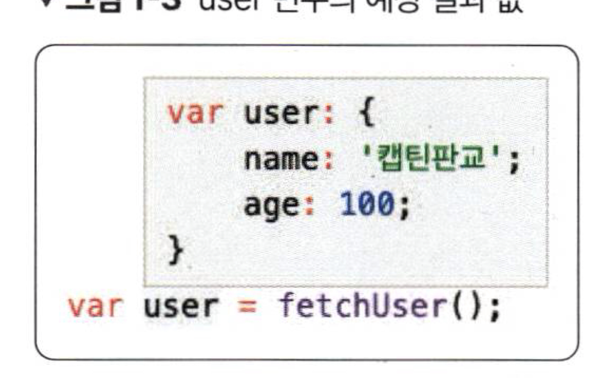
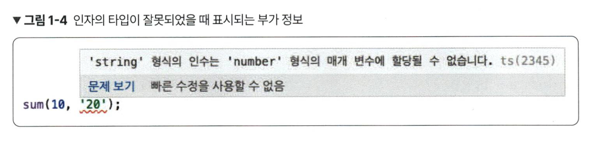
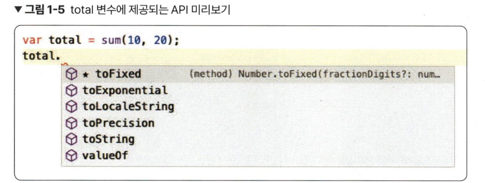

# 1장 타입스크립트 소개와 배경

## 타입스크립트란?

- 자바스크립트에 타입을 부여한 언어
    - 자바스크립트에서 타입을 알기 어려운 경우, 쉽게 알 수 있게 도와줌
    



## 타입스크립트의 장점

1. 에러의 사전 방지
    
    ```tsx
    function sum(a: number, b: number) {
    	return a+b;
    }
    ```
    
    
    
    - 위와 같이 함수를 호출할 때, 매개 변수의 타입을 선언해줌으로써 에러를 방지할 수 있음
2. 코드 가이드 및 자동 완성
    1. 예시 : toFixed() API
        1. 변수의 타입이 숫자일 때 사용할 수 있는 API
        
        
        
        - 위와 같이 Number 타입에서 사용할 수 있는 내장 API를 모두 보여줌.

## 타입스크립트의 현실적인 대안 JSDoc

- 자바스크립트 코드에 주석을 다는 표준 방식

```tsx
// @ts-check

/**
* @description 두 수의 합을 구하는 함수
* @param {number} a 첫 번째 숫자
* @param {number} b 두 번째 숫자
*/
function sum(a,b) {
	return a+b;
}
sum(10, '20')
```

- 위와 같이 사용 시, 미리 정의한 타입과 맞지 않는 경우 미리 에러를 표시해 줌
- JSDoc을 사용시, API 자동 완성 지원 동일하게 받을 수 있음
