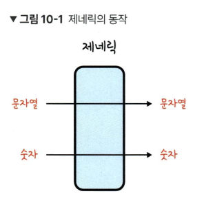

# 10장 제네릭

## 10.1 제네릭이란?
- 제네릭은 타입을 미리 정의하지 않고 사용하는 시점에 원하는 타입을 정의해서 쓸 수 있는 문법
- 타입을 넘기고 그 타입을 그대로 반환받는다
- 

## 10.2 제네릭 기본 문법
``` tsx
function getText<T>(text:T): T{
    return text;
}

getText<string>('hi');

// 위 코드는 getText() 함수를 호출할 때 제네릭에 문자열 데이터 타입인 string 타입을 할당함
```

## 10.3 왜 제네릭을 사용할까?
- 중복되는 타입 코드의 문제점
    - 중복을 줄일 수 있음
- any를 쓰면 되지 않을까?
    - 타입스크립트의 코드 자동 완성이나 에러의 사전 방지 혜택을 받지 못함

## 10.4 인터페이스에 제네릭 사용하기
``` tsx
interface ProductDropdown{
    value: string;
    selected: boolean;
}

interface StockDropdown{
    value: number;
    selected: boolean;
}


// 아래와 같이 제네릭을 쓸 수 있음
interface Dropdown<T> {
    value: T;
    selected: boolean;
}
```

## 10.5 제네릭의 타입 제약
- extends를 사용한 타입 제약
``` tsx
function embraceEveryThing<T extends string>(thing: T): T{
    return thing;
}
```

- 타입 제약의 특징
    - e.g. length 속성을 갖는 타입을 갖도록 제약
- keyof를 사용한 타입 제약
    - 특정 타입의 키 값을 추출해서 문자열 유니언 타입으로 변환해줌
    - keyof {name:string; value:number;}

## 10.6 제네릭을 처음 사용할 때 주의해야할 사고방식
    - 함수안에서는 어떠한 타입이 올지 모르기 때문에 text.length 처럼 쓰면 안됨