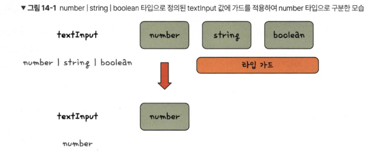

# 14장 타입 가드

# 14.1 타입 가드란?
- 타입 가드 : 여러 개의 타입으로 지정된 값을 특정 위치에서 원하는 타입으로 구분

```typescript
function updateInput(textInput: number | string | boolean) {
// 타입 가드
    if (typeof textInput === 'number') {
        textInput;
    }
}
```

## 14.2 왜 타입 가드가 필요할까?
```typescript
function updateInput(textInput: number | string | boolean) {
// number 타입이 아닐 때 에러가 발생함
    textInput.toFixed(2);
}
```

> 타입 단언으로 타입 에러 해결하기
```typescript
function updateInput(textInput: number | string | boolean) {
// 타입 에러가 발생하지 않지만, 실행 시점의 에러가 발생함
    (textInput as number).toFixed(2);
}
```

> 타입 가드로 문제점 해결하기
```typescript
function updateInput(textInput: number | string | boolean) {
    if (typeof textInput === 'number') {
        textInput.toFixed(2);
        return;
    }

    if (typeof textInput === 'string') {
        console.log(textInput.length);
        return;
    }
}
```

## 14.3 타입 가드 문법
- typeof
- instanceof
- in

> typeof 연산자
```typescript
typeof 10; // 'number'
typeof 'hello'; // 'string'
typeof function() {}; // 'function'
```

> instanceof 연산자
- 변수가 해당 객체의 프로타티입 체인에 포한되는지 확인하여 ture/false를 반환
```javascript
function Person(name, age) {
this.name = name;
this.age = age;
}

var captain = new Person('캡틴', 100);
captain instanceof Person; // true
```

> in 연산자
```javascript
var book = {
name: '길벗 타임스크립트',
rank: 1
};

console.log('name' in book); // true
```

## 14.4 타입 가드 함수
- 타입 가드 함수는 is 연산자를 사용하여 여러 개의 타입 중 하나로 구분
```typescript
function isPerson(someone: Person | Developer): someone is Person {
    return (someone as Person).age !== undefined；
}
```

## 14.5 구별된 유니언 타입
- 구별된 유니언 타입은 유니언 타입을 구성하는 여러 개의 타입을 특정 속성의 유무가 아니라 특정 속성 값으로 구분하는 타입 가드 문법을 의미함
```typescript
interface Person {
    name: string;
    age: number;
    industry: 'common';
}

interface Developer {
    name: string;
    age: string;
    industry: 'tech';
}
```

```typescript
function greet(someone: Person | Developer) {
    if (someone.industry === 'common') {
    // someone의 타입은 Person 타입으로 추론된다.
    }
}
```

## 14.6 switch 문과 연산자
> switch 문
```typescript
interface Person {
    name: string;
    age: number;
    industry: 'common';
}

interface Developer {
    name: string;
    age: string;
    industry: 'tech';
}

function greet(someone: Person | Developer) {
    switch (someone.industry) {
        case 'common':
            console.log(someone.age.toFixed(2));
            break;
        case 'tech':
            console.log(someone.age.split(''));
            break;
    }
}
```
> 논리 비교 연산자
```typescript
function sayHi(message: string | null) {
    if (message && message.length >= 3) {
        console.log(message);
    }
}
```