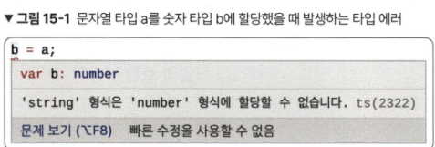

# 15장 타입 호환

## 타입 호환이란?
- 서로 다른 타입이 2개 있을 때 특정 타입이 다른 타입에 포함되는지를 의미
- ```typescript
    // 에러 발생
    var a: string = 'hi';
    var b: number = 10;

    b = a;
    ```
- 
- ```typescript
    // 에러 발생하지 않음
    var a: string = 'hi';
    var b: 'hi' = 'hi';

    a = b;
    ```

## 다른 언어와 차이점
- ```typescript
    // 정상동작함
    interface Ironman {
        name: string;
    }

    class Avengers {
        name: string;
    }

    let i: Ironman;
    i = new Avengers();
    ```
- 구조적 타이핑 : 타입 유형보다는 타입 구조로 호환 여부를 판별하는 언어적 특성

## 객체 타입의 호환
- ```typescript
    // 예제 1
    type Person = {
        name: string;
    };

    interface Developer {
        name: string;
    }

    var joo: Person = {
        name: '형주'
    };

    var capt: Developer = {
        name: '캡틴'
    };

    // 둘 다 가능
    capt = joo;
    joo = capt;

    // 예제2
    type Person = {
        name: string;
    };

    interface Developer {
        name: string;
        skill: string;
    }

    var joo: Person = {
        name: '형주',
    };

    var capt: Developer = {
        name: '캡틴',
        skill: '방패 던지기'
    };

    joo = capt; // 가능
    capt = joo; // 불가능
    // capt에게 필수값인 skill이 joo에는 없기 때문
    // joo에게 skill을 추가하거나 capt에게 skill을 옵셔널로 변경하면됨
    ```
## 함수 타입의 호환
- 
    ```typescript
    // 예제 1
    var add = function(a: number, b: number) {
        return a + b;
    };
    
    var sum = function(x: number, y: number) {
        return x + y;
    };

    // 가능
    add = sum;
    sum = add;

    // 예제 2
    var getNumber = function(num: number) {
        return num;
    };

    var sum = function(x: number, y: number) {
        return x + y;
    };

    // 불가능
    // 파라미터 개수가 다름
    getNumber = sum;
    ```

## 이넘 타입의 호환
- ```typescript
    enum Language {
        C,        // 0
        Java,     // 1
        TypeScript // 2
    }

    // 성공
    var a: number = 10;
    a = Language.C;

    enum Language {
    C,
    Java,
    TypeScript,
    }

    enum Programming {
        C,
        Java,
        TypeScript,
    }

    // 에러발생
    // 동일한 속성과 값을 가졌더라도 이넘 타입 간에는 서로 호환되지 않음
    var langC：Language.C;
    langC = Programming.C ；
    ```
## 제네릭 타입의 호환
- ```typescript
    interface Empty<T> {
    }

    var empty1: Empty<string>;
    var empty2: Empty<number>;

    // 성공
    // 제네릭으로 받은 타입이 해당 타입 구조에서 사용되지 않는다면 타입 호환에 영향을 미치지 않는다.
    empty2 = empty1;
    empty1 = empty2;
    ```