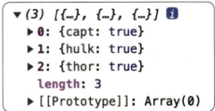
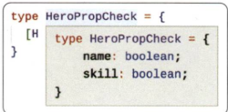

# 18장 맵드 타입

## 맵드 타입 첫 번째 예시:in
- 맵드 타입 : 이미 정의된 타입을 가지고 새로운 타입을 생성할 때 사용
- ```typescript
    type HeroNames = 'capt' | 'hulk' | 'thor';

    type HeroAttendance = {
        [Name in HeroNames]: boolean;
    };
    ```

## map()으로 이해하는 맵드 타입
- ```javascript
    var heroes = ['capt', 'hulk', 'thor'];
    var heroAttendance = heroes.map(function(hero) {
        return {
            [hero]: true
        };
    });
    ```
- 

## 맵드 타입 두 번째 예시:keyof
- ```typescript
    interface Hero {
        name: string;
        skill: string;
    }

    type HeroPropCheck = {
        [H in keyof Hero]: boolean;
    };
    ```
- 

## 맵드 타입을 사용할 때 주의할 점
- ```typescript
    // 인터페이스 타입으로 맵드 타입을 생성
    interface Hero {
        name: string;
        skill: string;
    }

    type HeroPropCheck = {
        [H in keyof Hero]: boolean;
    };

    // 타입 별칭으로 맵드 타입을 생성
    type Hero = {
        name: string;
        skill: string;
    };

    type HeroPropCheck = {
        [H in keyof Hero]: boolean;
    };
    ```


## 매핑 수정자
- 매핑 수정자 : 맵드 타입으로 타입을 변한할 때 속성 성질을 변환할 수 있도록 도와주는 문법
- +, -, ?, readonly 등이 있음
    - ? : 옵셔널한 값으로 변경
    - -? : 제네릭으로 받은 속성의 옵션 속성을 모두 제거
    - `-` : 옵션 속성을 필수 속성으로 변경 