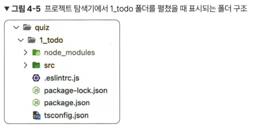
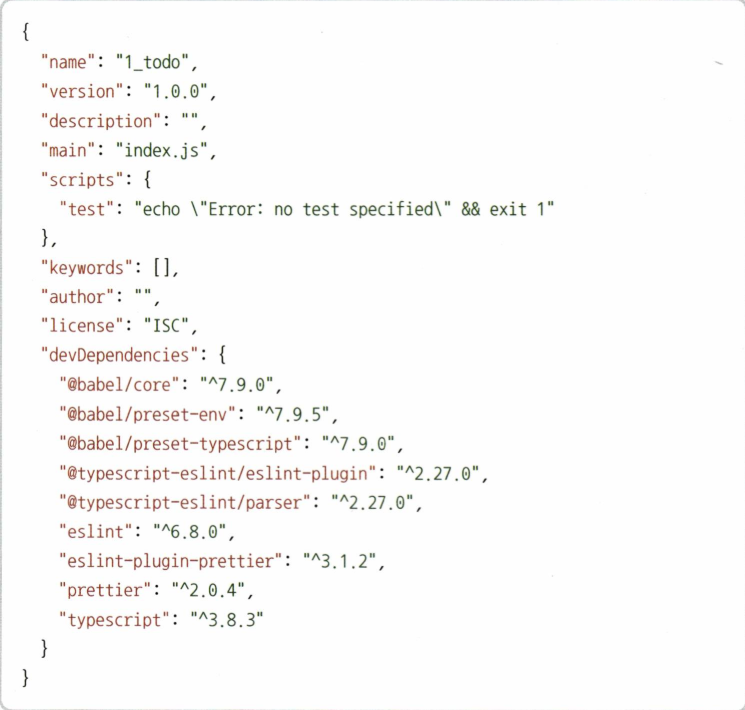
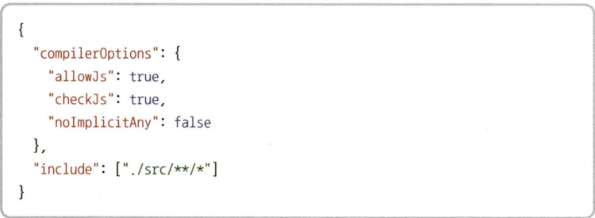
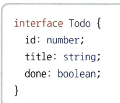

# 첫 번째 프로젝트 : 할일 관리 앱

## 4.2 프로젝트 폴더 구조

> node_modules 폴더

- npm i 명령어를 입력해서 설치한 라이브러리
- npm 기반의 웹 애플리케이션을 실행하는데 필요한 폴더

> src 폴더

- index.ts

> .eslintrc.js 파일

- 문법 검사 도구
- 타입스크립트까지 검사가능

> package.json 파일

- NPM 설정 파일
- 프로젝트 이름, 버전, 라이센스 등 기본 정보
- 라이브러리 목록을 저장
- 
- name : 프로젝트 이름
- version : 프로젝트 버전
- description : 프로젝트 설명
- main : 프로젝트 메인 파일
- scripts : 프로젝트 명령어

> package-lock.json 파일

- 라이브러리 설치할 때 필요한 부수 라이브러리의 버전을 관리

> tsconfig.json 파일

- 
- compilerOption : 타입스크립트로 컴파일할 때 세부적인 동작을 지정하는 옵션
  - allowJs : 타입스크립트로 프로젝트를 컴파일할 때 자바스크립트 파일도 컴파일 대상에 포함시킬지 선택하는 옵션
  - checkJs : 자바스크립트 파일에서 타입스크립트 컴파일 규칙을 적용할지 선택하는 옵션
  - noImplicitAny : true 일 때 암묵적으로 any로 추론
  - include : 타입스크립트 컴파일 대상 경로 지정

> 프로젝트 로직

- 반복되는 타입 코드 줄이기
  - interface라는 키워드를 사용하여 데이터 타입을 별도의 이름으로 선언할 수 있음
  - 
