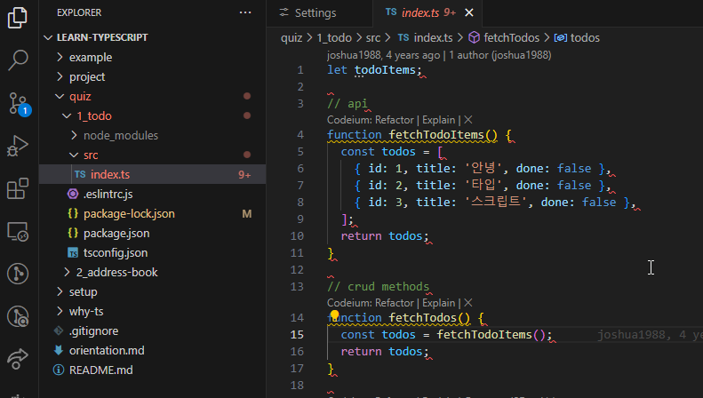
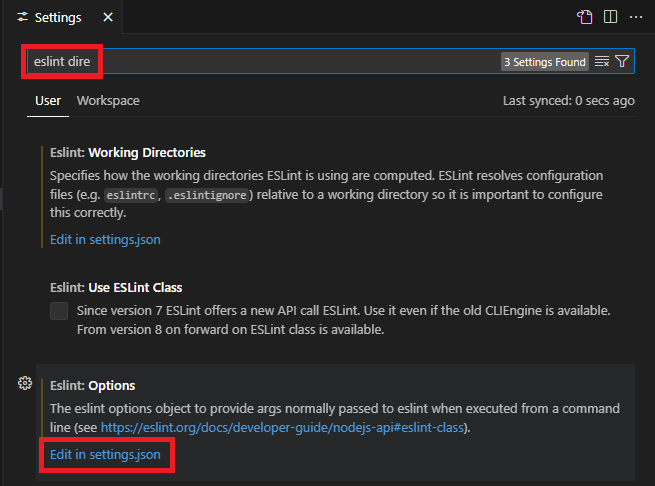
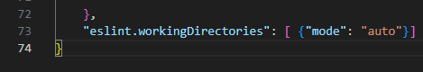

## 참고 파일
[GitHub - joshua1988/learn-typescript: Best way to learn TypeScript](https://github.com/joshua1988/learn-typescript)

[GitHub - gilbutITbook/080316](https://github.com/gilbutITbook/080316)

## 4장 첫 번째 프로젝트: 할 일 관리 앱

### 4.1 프로젝트 내려받기 및 라이브러리 설치
- 깃허브에서 프로젝트 예제 코드를 내려받음.
- NPM을 사용하여 프로젝트에 필요한 라이브러리 설치.
- 예시 명령어:
  ```bash
  npm install
  ```

`.\quiz\1_todo` 경로 우클릭 후 Open in Integrated Terminal

`npm i` 입력해서 프로젝트 진행에 필요한 라이브러리 설치

`.\src` 폴더의 `index.ts` 열고 아래처럼 노란 밑줄 확인 (ESLint 동작 여부)


노란 밑줄 노출 안 되면 ESLint 설정 아래처럼 변경


(위 설정을 추가함)


### 4.2 프로젝트 폴더 구조
- 프로젝트 주요 폴더 및 파일:
  - `node_modules`: 설치된 라이브러리 폴더
  - `src`: 소스 코드 폴더
  - `.eslintrc.js`: ESLint 설정 파일
  - `package.json`: NPM 설정 파일
      - 프로젝트 이름，버전, 라이선스, 로컬 개발 필요 라이브러리 목록 등


```json
{
    "name": "1_todo",
    "version": "1.0.0",
    "description": "",
    "main": "index.js",
    "scripts": {
      "test": "echo \"Error: no test specified\" && exit 1"
    },
    "keywords": [],
    "author": "",
    "license": "ISC",
    "devDependencies": {
      "@babel/core": "^7.9.0",
      "@babel/preset-env": "^7.9.5",
      "@babel/preset-typescript": "^7.9.0",
      "@typescript-eslint/eslint-plugin": "^2.27.0",
      "@typescript-eslint/parser": "^2.27.0",
      "eslint": "^6.8.0",
      "eslint-plugin-prettier": "^3.1.2",
      "prettier": "^2.0.4",
      "typescript": "^3.8.3"
    }
}
```

- name: 프로젝트 이름
- version: 프로젝트 버전
- description: 프로젝트 설명
- main: 프로젝트 메인 파일
- scripts: 프로젝트 명령어. 임의로 명령어를 생성해서 `npm run 명령어이름` 형태로 해당 명령어 실행 가능
- keywords: NPM 사이트에서 검색할 때 연관될 검색어
- author: 프로젝트 작성자
- license: 프로젝트 라이선스 종류 표기
- devDependencies: 프로젝트를 로컬에서 개발할 때 도움을 주는 라이브러리 목록. 예를 들어 로컬에서 사용할 개발 서버나 코드 문법 검사도구 등


- `package-lock.json`: 의존성 명시된 라이브러리 설치할 때 필요한 부수 라이브러리 버전 관리 (자동 생됨)
- `tsconfig.json`: 타입스크립트 설정 파일

```json
{
    "compilerOptions": {
      "allowJs": true,
      "checkJs": true,
      "noImplicitAny": false
    },
    "include": ["./src/**/*"]
}
```

- `compilerOptions`: 타입스크립트로 컴파일할 때 세부적인 동작을 지정할 수 있는 옵션.
    - `allowJs`: 타입스크립트로 프로젝트를 컴파일할 때 자바스크립트 파일도 컴파일 대상에 포함시킬지 선택하는 옵션.
    - `checkJs`: 주로 `allowJs` 옵션과 같이 사용되며 프로젝트 내 자바스크립트 파일에서 타입스크립트 컴파일 규칙을 적용할지 선택하는 옵션. 1장에서 살펴본 자바스크립트 파일의 맨 위에 `// @ts-check`를 넣은 것과 효과가 같음. `true`를 선택하면 자바스크립트 파일 내부의 에러도 타입스크립트 컴파일 규칙에 따라 검증한 후 에러를 표시.
    - `noImplicitAny`: 타입스크립트는 타입스크립트 코드의 타입을 따로 지정하지 않으면 암묵적으로 모든 타입을 `any`로 추론함. 이런 성질을 끄고 켤 수 있는 옵션. `true` 값을 넣으면 암묵적인 `any` 타입 추론이 되지 않아 타입을 `any`로라도 꼭 정의해 주어야 함. 따라서 타입이 지정되어 있지 않은 자바스크립트 코드 경고를 표시.
- `include`: 타입스크립트 컴파일 대상 경로를 지정. `./src/**/*`는 src 폴더 아래의 모든 파일에서 타입스크립트 컴파일을 돌리겠다는 의미.


### 4.3 프로젝트 로직
- 주요 함수 정의:
  - `fetchTodoItems()`: 할 일 목록 데이터를 반환
    ```typescript
    function fetchTodoItems() {
      const todos = [
        { id: 1, title: '안녕', done: false },
        { id: 2, title: '타입', done: false },
        { id: 3, title: '스크립트', done: false }
      ];
      return todos;
    }
    ```
  - `addTodo()`: 할 일 추가
    ```typescript
    function addTodo(todo) {
      todoItems.push(todo);
    }
    ```
  - `deleteTodo()`: 할 일 삭제
    ```typescript
    function deleteTodo(index) {
      todoItems.splice(index, 1);
    }
    ```
  - `completeTodo()`: 할 일 완료 처리
    ```typescript
    function completeTodo(index, todo) {
      todo.done = true;
      todoItems.splice(index, 1, todo);
    }
    ```
  - `logFirstTodo()`: 첫 번째 할 일 로그 출력
    ```typescript
    function logFirstTodo() {
      return todoItems[0];
    }
    ```
  - `showCompleted()`: 완료된 할 일 목록 표시
    ```typescript
    function showCompleted() {
      return todoItems.filter(item => item.done);
    }
    ```


참고) 
```js
 array.splice(start[, deleteCount[, item1[, item2[, ...]]]])
```
start 부터 deleteCount 제거 후 item 추가
### 4.4 프로젝트 실습
- 실습 목표: 할 일 관리 앱에 타입스크립트 적용
- 할 일 목록 데이터를 조작하는 함수들 구현

#### ESLint의 에러(노란색 줄)가 표시되는 부분의 타입 정의.

```ts
function fetchTodoItems(): { id: number; title: string; done: boolean }[] {
  const todos = [
    { id: 1, title: '안녕', done: false },
    { id: 2, title: '타입', done: false },
    { id: 3, title: '스크립트', done: false },
  ];
  return todos;
}
```

#### todoItems 변수의 타입 선언

```ts
let todoItems: { id: number; title: string; done: boolean }[];
```

#### todoItems 변수의 타입 선언에 따라 발생하는 에러 코드 정리 및 타입 정의

없는데?
#### 함수 파라미터나 내부 로직의 타입 정의

```ts
function fetchTodos(): { id: number; title: string; done: boolean }[] {
  const todos: {
    id: number;
    title: string;
    done: boolean;
  }[] = fetchTodoItems();
  return todos;
}

```

#### addTwoTodoItems() 함수 구현

```ts
function addTwoTodoItems(): void {
  // addTodo() 함수를 두 번 호출하여 todoItems에 새 할 일이 2개 추가되어야 합니다.
  addTodo({ id: 4, title: 'A', done: false });
  addTodo({ id: 5, title: 'B', done: false });
}
```

```console
> ts-node .\index.ts
[
  { id: 1, title: '안녕', done: false },
  { id: 2, title: '타입', done: false },
  { id: 3, title: '스크립트', done: false },
  { id: 4, title: 'A', done: false },
  { id: 5, title: 'B', done: false }
]
```
#### 정의한 타입 중에서 좀 더 적절한 타입을 정의할 수 있는 곳이 있는지 확인 및 정의

모르겠다.

### 4.5 프로젝트 실습 풀이
#### 4.5.1 함수의 반환 타입 정의
- 함수 반환 타입 명시:
  ```typescript
  function fetchTodos(): { id: number; title: string; done: boolean }[] {
    const todos = fetchTodoItems();
    return todos;
  }
  ```
- `addTodo()` 함수의 파라미터 타입 정의:
  ```typescript
  function addTodo(todo: { id: number; title: string; done: boolean }): void {
    todoItems.push(todo);
  }
  ```
- `deleteTodo()` 함수의 파라미터 타입 정의:
  ```typescript
  function deleteTodo(index: number): void {
    todoItems.splice(index, 1);
  }
  ```
- `completeTodo()` 함수의 파라미터 타입 정의:
  ```typescript
  function completeTodo(index: number, todo: { id: number; title: string; done: boolean }): void {
    todo.done = true;
    todoItems.splice(index, 1, todo);
  }
  ```
- `logFirstTodo()` 함수의 반환 타입 정의:
  ```typescript
  function logFirstTodo(): { id: number; title: string; done: boolean } {
    return todoItems[0];
  }
  ```
- `showCompleted()` 함수의 반환 타입 정의:
  ```typescript
  function showCompleted(): { id: number; title: string; done: boolean }[] {
    return todoItems.filter(item => item.done);
  }
  ```

#### 4.5.2 할 일 목록 변수인 `todoItems` 타입 정의
- `todoItems` 변수의 타입 정의:
  ```typescript
  let todoItems: { id: number; title: string; done: boolean }[];
  ```

#### 4.5.3 함수 파라미터 타입 구체화
- 파라미터 타입을 구체적으로 정의하여 코드의 안전성 확보

#### 4.5.4 `addTwoTodoItems()` 함수 구현
- 새로운 할 일 두 개 추가하는 함수:
  ```typescript
  function addTwoTodoItems() {
    addTodo({ id: 4, title: '타입 정의', done: false });
    addTodo({ id: 5, title: '복습', done: false });
  }
  ```

#### 4.5.5 반복되는 타입 코드 줄이기
- 인터페이스를 사용하여 반복되는 타입 코드 줄이기:
  ```typescript
  interface Todo {
    id: number;
    title: string;
    done: boolean;
  }
  let todoItems: Todo[];
  function fetchTodos(): Todo[] {
    const todos = fetchTodoItems();
    return todos;
  }
  function addTodo(todo: Todo): void {
    todoItems.push(todo);
  }
  function completeTodo(index: number, todo: Todo): void {
    todo.done = true;
    todoItems.splice(index, 1, todo);
  }
  ```

### 4.6 정리
- 타입스크립트를 적용하여 할 일 관리 앱을 구현하며 타입 정의의 중요성을 학습.
- 인터페이스를 사용하여 코드 가독성과 유지보수성을 높임.

## 5장 인터페이스

### 5.1 인터페이스란?
인터페이스는 타입스크립트에서 객체의 타입을 정의할 때 사용하는 문법. 자바나 C++의 인터페이스와 유사하게 객체의 구조를 정의하는 역할을 함.

인터페이스로 타입을 정의할 수 있는 부분
- 객체의 속성과 속성 타입
- 함수의 파라미터와 반환 타입
- 함수의 스펙(파라미터 개수와 반환값 여부 등)
- 배열과 객체를 접근하는 방식
- 클래스
### 5.2 인터페이스를 이용한 객체 타입 정의
객체의 타입을 인터페이스로 정의할 수 있음. 예를 들어, `User`라는 인터페이스를 선언하고 `name`과 `age` 속성을 정의할 수 있음.
```typescript
interface User {
  name: string;
  age: number;
}
let user: User = { name: 'John', age: 30 };
```

### 5.3 인터페이스를 이용한 함수 타입 정의
함수의 파라미터와 반환 타입을 인터페이스로 정의할 수 있음. 이를 통해 함수의 구조를 명확히 할 수 있음.
#### 5.3.1 함수 파라미터 타입 정의
함수의 파라미터 타입을 정의하여 함수의 인자로 전달될 객체의 구조를 명확히 할 수 있음.
```typescript
interface Person {
  name: string;
  age: number;
}
function greet(person: Person): void {
  console.log(`Hello, ${person.name}`);
}
```
#### 5.3.2 함수 반환 타입 정의
함수의 반환 타입을 인터페이스로 정의하여 함수가 반환하는 객체의 구조를 명확히 할 수 있음.
```typescript
interface ApiResponse {
  data: any;
  status: number;
}
function fetchData(): ApiResponse {
  return { data: 'data', status: 200 };
}
```

### 5.4 인터페이스의 옵션 속성
인터페이스의 속성 중 일부를 옵션으로 정의할 수 있음. 속성명 뒤에 `?`를 붙여서 정의.
```typescript
interface Car {
  make: string;
  model?: string;
}
let myCar: Car = { make: 'Toyota' };
```

### 5.5 인터페이스 상속
인터페이스는 다른 인터페이스를 상속받아 확장할 수 있음. 이를 통해 인터페이스를 재사용하고 확장할 수 있음.
#### 5.5.1 인터페이스의 상속이란?
인터페이스가 다른 인터페이스를 상속받아 부모 인터페이스의 속성을 물려받는 것.
```typescript
interface Animal {
  name: string;
}
interface Dog extends Animal {
  age: number;
}

var dog: Dog = {
  name: "meong",
  age: 5
}
```
#### 5.5.2 인터페이스를 상속할 때 참고 사항
상속받는 인터페이스는 부모 인터페이스의 모든 속성을 포함해야 함(재정의 불가) 추가적인 속성을 정의할 수 있음.

상속을 여러 단계에 걸쳐 할 수도 있

### 5.6 인터페이스를 이용한 인덱싱 타입 정의
인터페이스를 사용하여 배열이나 객체의 인덱싱 타입을 정의할 수 있음. 이를 통해 데이터 구조의 타입을 보다 명확히 할 수 있음.
#### 5.6.1 배열 인덱싱 타입 정의
배열의 인덱스와 요소의 타입을 인터페이스로 정의할 수 있음.
```typescript
interface StringArray {
  [index: number]: string;
}
let companies: StringArray = ['삼성', '네이버', '구글'];

companies[0]; // 삼성
```

`index`는 `number` 타입이어야 한다는 제한

#### 5.6.2 객체 인덱싱 타입 정의
객체의 속성 이름과 값의 타입을 인터페이스로 정의할 수 있음.
```typescript
interface SalaryMap {
  [level: string]: number;
}
let salaries: SalaryMap = { junior: 50000, senior: 100000 };
console.log(salaries['junior']);
```
객체 속성 key 타입을 string, value 타입을 number로 제한함. 

#### 5.6.3 인덱스 시그니처란?
인덱스 시그니처는 객체의 속성 이름이 특정 타입이고, 속성 값이 특정 타입임을 나타내는 문법.

```typescript
// 인덱스 시그니처
interface SalaryInfo {
  [level: string]: string;
}

// 인터페이스
var salary: SalaryInfo = {
  junior: '100원',
  mid: '400원',
  senior: '700원',
  ceo: '0원',
  newbie: '50원'
};
```

인덱스 시그니처를 사용하면 인터페이스를 수정하지 않고 속성을 추가할 수 있다.
#### 5.6.4 인덱스 시그니처는 언제 쓸까?
인덱스 시그니처는 객체의 속성 이름과 값의 타입을 **동적으로 정의**할 때 사용.

인덱스 시그니처 문법은 섞어 쓸 수도 있음.

```ts
interface User {
  [property: string]: string;
  id: string;
  name: string;
}

var seho: User = {
  id: '1',
  name: '세호',
};

console.log(seho);
```

key 이름 property 는 예약어가 아님. 그냥 아무 이름이나 됨.
### 5.7 정리
인터페이스는 타입스크립트에서 객체, 함수, 배열 등의 타입을 정의하는 강력한 도구. 이를 통해 코드의 구조를 명확히 하고, 재사용성과 유지보수성을 높일 수 있음.