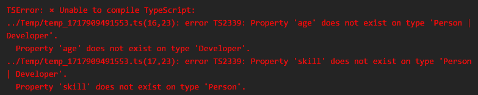
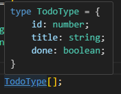
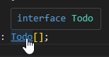

## 참고 파일

- [GitHub - joshua1988/learn-typescript: Best way to learn TypeScript](https://github.com/joshua1988/learn-typescript)
- [GitHub - gilbutITbook/080316](https://github.com/gilbutITbook/080316)

# 6장: 연산자를 사용한 타입 정의

## 6.1 유니언 타입

- **유니언 타입**: 여러 개의 타입 중 하나를 사용 (`string | number`).
- **예시**:
  ```typescript
  function logText(text: string | number) {
    console.log(text);
  }
  logText('hi'); // 'hi'
  logText(100); // 100
  ```

## 6.2 유니언 타입의 장점

- **코드 중복 제거**: 동일한 기능을 하는 여러 함수를 하나로 통합.
- **타입 정확도 증가**: `any` 타입 대신 사용해 더 정확한 타입 선언 가능.
- **자동 완성 기능**: 특정 API 사용 시 자동 완성 지원.

## 6.3 유니언 타입을 사용할 때 주의할 점

- **특정 타입의 속성 접근 제한**: 유니언 타입 변수의 경우 모든 가능한 타입에 존재하는 속성만 접근 가능.

  ```typescript
  interface Person {
    name: string;
    age: number;
  }
  
  interface Developer {
    name: string;
    skill: string;
  }
  
  function introduce(someone: Person | Developer) {
    console.log(someone.name); // 가능
    console.log(someone.age); // 에러
    console.log(someone.skill); // 에러
  }
  ```



```ts
  interface Person {
    name: string;
    age: number;
  }
  
  interface Developer {
    name: string;
    skill: string;
  }

function introduce(someone: Person | Developer) {
  console.log(typeof someone);
  if ('age' in someone) {
    console.log(someone.age);
    return;
  }
  if ('skill' in someone) {
    console.log(someone.skill);
    return;
  }
}

introduce({name: 'jk', age: 1});
```

위와 같이 JS의 in 연산자로 객체에 특정 속성이 있는지 확인 가능

```ts
function logText(text: string | number) {
  if (typeof text === 'string') {
    console.log(text.toUpperCase());
  }
  if (typeof text === 'number') {
    console.log(text.toLocaleString());
  }
}
```

JS의 typeof 연산자로 타입을 확인할 수 있음. 근데 JS 연산자라 그런지 인터페이스 정보는 안 나오는 듯

> 이렇게 타입을 구분하고 코드를 작성하는 동작을 타입 가드라고 하며, 14장에서 살펴봄

## 6.4 인터섹션 타입

- **인터섹션 타입**: 여러 개의 타입을 모두 만족 (`A & B`).
    - 두 타입의 교집합을 정의하겠다는 것임. 원소의 연산으로 접근하면 안 됨.
    - 기본 타입의 &과 객체 타입의 &을 잘 생각해보기.
        - 기본 타입간 &는 존재할 수 없다(never)
- **예시**:
  ```typescript
  interface User {
    id: number;
    name: string;
  }
  
  interface Admin {
    privileges: string[];
  }
  
  type AdminUser = User & Admin;
  const admin: AdminUser = {
    id: 1,
    name: 'John',
    privileges: ['server']
  };
  ```

## 6.5 정리

- **유니언 타입**: OR 연산자(`|`) 사용, 주어진 타입을 할당 받을 수 있는 타입
    - 슈퍼셋 생성됨
- **인터섹션 타입**: AND 연산자(`&`) 사용, 주어진 타입에게 할당할 수 있는 타입
    - 서브셋 생성됨
- **실용성**: 코드 중복 제거, 타입 안정성 증가, 자동 완성 기능 강화.


# 7장: 타입 별칭

## 7.1 타입 별칭이란?

- **타입 별칭 (Type Alias)**: 특정 타입이나 인터페이스에 별명을 붙여서 재사용하는 것
  ```typescript
  type MyString = string;
  type Person = {
    name: string;
    age: number;
  };
  ```

참고: 타입 별칭 재할당 불가

## 7.2 타입 별칭과 인터페이스의 차이점

### 7.2.1 **코드 에디터에서 표기 방식 차이**

  - 타입 별칭은 `type` 키워드를 사용. IDE 툴팁에서 shape 노출됨.
  - 인터페이스는 `interface` 키워드를 사용. IDE 툴팁에서 shape 노출 안 됨.
  ```typescript
  type MyType = { name: string; age: number };
  interface MyInterface { name: string; age: number }
  ```



### 7.2.2 사용할 수 있는 타입의 차이

- **타입 별칭**: 일반 타입, 유니언 타입, 인터섹션 타입 등에 사용 가능.
  ```typescript
  type ID = string;
  type Product = TShirt | Shoes;
  type Teacher = Person & Adult;
  ```
- **인터페이스**: 주로 객체의 타입을 정의하는데 사용.
  ```typescript
  interface Person { name: string; age: number; }
  ```

### 7.2.3 타입 확장 관점에서 차이

- **인터페이스**: 상속을 통해 타입 확장.
  ```typescript
  interface Developer extends Person { skill: string; }
  ```
- **타입 별칭**: 인터섹션 타입으로 확장.
  ```typescript
  type Developer = Person & { skill: string; };
  ```

- **선언 병합**: 동일한 이름으로 인터페이스를 선언하면 내용을 합치는 특성
```ts
interface Person {
    name: string;
    age: number;
}

interface Person {
    address: string;
}

var seho: Person = {
    name: '세호',
    age: 30,
    address: '광교'
};
```

## 7.3 타입 별칭은 언제 쓰는 것이 좋을까?

- 2021년 이전의 TS 공식 문서에서는 `개방 폐쇄 원칙`을 근거로 인터페이스 사용을 권장하였으나, 2023년에는 이 내용이 없다. 인터페이스를 주로 사용해보고 필요할 때 쓰라고 나와있다.

### 7.3.1 타입 별칭으로만 정의할 수 있는 타입들

- 주요 데이터 타입, 유니언 타입, 인터섹션 타입 등은 타입 별칭으로 정의.
  ```typescript
  type MyString = string;
  type StringOrNumber = string | number;
  type Admin = Person & Developer;
  ```

제네릭 타입 정의
```typescript
type Dropdown<T> = {
    id: string;
    title: T;
}
```

유틸리티 타입
```typescript
type Admin = { 
    name: string; 
    age: number; 
    role: string; 
}

type OnlyName = Pick<Admin, 'name'>
```

맵드 타입
```typescript
type Picker<T, K extends keyof T> = {
    [P in K]: T[P];
}
```

### 7.3.2 백엔드와의 인터페이스 정의

- **웹 서비스 구조**: 프론트엔드와 백엔드로 나눔
  - **프론트엔드**: 사용자와 직접 상호작용하는 화면 개발
  - **백엔드**: 데이터를 가공하여 프론트엔드에 전달
  
- **인터페이스 정의 필요성**
  - **역할**: 프론트엔드와 백엔드 간 데이터 교환 규칙 설정
  - **작업**: 백엔드에서 전달할 데이터 형태를 정의
  - **중요성**: 데이터 일관성 유지 및 협업 효율성 증대
  
- **API 함수 설계**
  - **프론트엔드 작업**: 서버에 데이터 요청 및 결과 처리
  - **JSDoc 사용 예시**
    ```javascript
    /**
     * @typedef {Object} User
     * @property {string} id - 사용자 아이디
     * @property {string} name - 사용자 이름
     * @returns {User} 1번 사용자
     */
    function fetchData() {
      return axios.get('http://localhost:3000/users/1');
    }
    ```
  - **타입스크립트 변환 예시**
    ```typescript
    type User = {
      id: string;
      name: string;
    }

    function fetchData(): User {
      return axios.get('http://localhost:3000/users/1');
    }
    ```

- 인터페이스 사용 시 장점
    - 서비스 요구 사항 변경되어 데이터 구조 변경 시 유리함 (상속, 선언 병합)

## 7.4 정리

- 타입 별칭과 인터페이스의 차이점을 이해하고 상황에 맞게 사용하는 것이 중요.
- 타입 별칭은 반복되는 타입 코드를 줄이고, 타입에 의미를 부여하는데 유용.
- 인터페이스는 객체의 구조를 정의하고 확장하는데 유리.