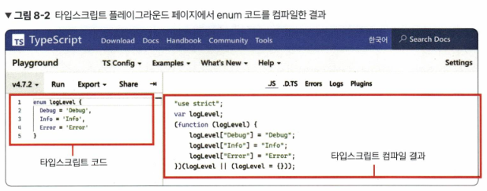
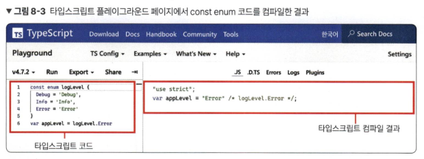
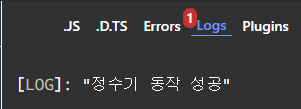
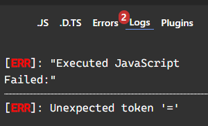

## 참고 파일

- [GitHub - joshua1988/learn-typescript: Best way to learn TypeScript](https://github.com/joshua1988/learn-typescript)
- [GitHub - gilbutITbook/080316](https://github.com/gilbutITbook/080316)

# 8장 이넘

## 8.1 이넘이란?

- 이넘(enum)은 특정 값의 집합을 의미하는 데이터 타입
    - 비슷한 성격, 같은 범주의 상수를 하나로 묶어 더 큰 단위의 상수로 만드는 것
        - 나이키, 아디다스, 뉴발란스 -> 신발 브랜드
- 자바스크립트에는 이넘이 없지만 타입스크립트에서는 지원
- 상수 집합이라고도 표현

### 상수의 예시
```typescript
const RICE = 10000;
const COKE = 2000;
```

### 이넘의 예시
```typescript
enum ShoesBrand {
  Nike,
  Adidas,
  NewBalance
}
```
- 각 속성에 숫자 값이 기본적으로 할당됨

## 8.2 숫자형 이넘

- 기본적으로 첫 번째 속성부터 0, 1, 2, 3이 할당됨
- 첫 번째 속성의 값을 변경하면 이후 값들도 1씩 증가
- 명시적으로 값을 설정하는 것이 좋음

### 숫자형 이넘의 예시
```typescript
enum Direction {
  Up = 10,
  Down,
  Left,
  Right
}
```

## 8.3 문자형 이넘

- 모든 속성 값을 문자열로 지정
- 속성 순서와 관계없이 각 속성에 문자열을 할당

### 문자형 이넘의 예시
```typescript
enum Direction {
  Up = 'Up',
  Down = 'Down',
  Left = 'Left',
  Right = 'Right'
}
```

```ts
enum ArrowKey {
  KEY_UP = 'KEY_UP',
  KEY_DOWN = 'KEY_DOWN'
}
```

- 실무에선 숫자형 이넘보다 문자형 이넘을 더 많이 쓴다. 왤까?
    - 가독성 향상
    - 디버깅 용이성
    - API 통신, 데이터 저장 시 일관성 유지
    - 확장
## 8.4 알아두면 좋은 이넘의 특징

### 8.4.1 혼합 이넘

- 숫자와 문자열을 혼합하여 선언 가능
    - 근데 비추 
```typescript
enum Answer {
  Yes = 'Yes',
  No = 1
}
```

### 8.4.2 다양한 이넘 속성 값 정의 방식

- 속성 값에 연산자 등을 활용 가능
    - 다만 활용도가 썩 높진 않다 이름만으로 값을 추측할 수 있는 문자열 값을 많이 쓴다.
```typescript
enum Authorization {
  User,
  Admin,
  SuperAdmin = User + Admin,
  God = "abc".length
}
```
- SuperAdmin은 1, God은 문자열 길이 3이 할당

### 8.4.3 const 이넘

- 컴파일 결과물의 코드 양을 줄이기 위해 사용
    - 일반 이넘은 객체가 되는데, const 이넘은 문자열로 치환된다. C의 매크로 생각하면 된다.
- 고정 값만 할당 가능
```typescript
const enum LogLevel {
  Debug = 'Debug',
  Info = 'Info',
  Error = 'Error'
}
```




## 8.5 정리

- 이넘은 여러 개의 상수를 하나의 단위로 묶어 사용
- 숫자형, 문자형, 혼합 이넘 등 다양한 형태로 활용 가능
- 속성 값에 문자열을 명시적으로 지정하는 방식이 일반적

# 9장 클래스

## 9.1 클래스란?

- 클래스는 C++, Java와 같은 객체 지향 언어에서 사용하는 개념
- 자바스크립트와 타입스크립트에서도 클래스 개념을 사용
- 클래스는 여러 가지 유사한 객체를 쉽게 생성하는 문법

> ES6 = ECMAScript 2015
> ES6+ = 2015년 이후 등장한 최신 자바스크립트 문법 (문법이 ES6 기점으로 크게 바뀜)

### 클래스의 예시

```js
function Person(name, skill) {
  this.name = name;
  this.skill = skill;
}

var capt = new Person('캡틴', '방패 던지기');
```

생성자 함수를 사용하여 객체 만들기 예시

```javascript
class Person {
  constructor(name, skill) {
    this.name = name;
    this.skill = skill;
  }

  sayHi() {
    console.log('hi');
  }
}
```

클래스 문법을 활용하면 이렇다
## 9.2 클래스 기본 문법

- 클래스는 `class` 키워드로 선언
- 생성자 메서드는 `constructor` 키워드로 정의
- 클래스 속성과 메서드는 `this` 키워드로 접근

### 기본 클래스 선언 예시
```typescript
class Person {
  name: string;
  skill: string;

  constructor(name: string, skill: string) {
    this.name = name;
    this.skill = skill;
  }

  sayHi(): void {
    console.log('hi');
  }
}
```

`sayHi()` 는 클래스 메서드, `name`, `skill` 은 클래스 속성이라고 한다. 

클래스로 생성된 객체를 클래스 인스턴스라고 한다.

## 9.3 클래스의 상속

- `extends` 키워드를 사용하여 상속 구현
- 자식 클래스는 부모 클래스의 속성과 메서드 사용 가능
- 부모 클래스의 생성자 메서드를 호출하기 위해 `super` 키워드 사용

### 클래스 상속 예시
```javascript
class Person {
  constructor(name, skill) {
    this.name = name;
    this.skill = skill;
  }

  sayHi() {
    console.log('hi');
  }
}

class Developer extends Person {
  constructor(name, skill) {
    super(name, skill);
    this.sayHi();
  }

  coding() {
    console.log('fun doing ' + this.skill + ' by ' + this.name);
  }
}

var capt = new Developer('캡틴', 'TypeScript');
capt.coding();
```

## 9.4 타입스크립트의 클래스

- 클래스 속성과 메서드에 타입을 지정
- 클래스 속성은 클래스 이름 바로 아래에 선언
- 타입스크립트의 접근 제어자: `public`, `private`, `protected`

### 타입스크립트 클래스 예시
```typescript
class Chatgpt {
  name: string; // 생성자 메서드에서 사용될 클래스 속성을 미리 정의해야 한다

  constructor(name: string) {
    this.name = name;
  }

  sum(a: number, b: number): number {
    return a + b;
  }
}
```

## 9.5 클래스 접근 제어자

### 9.5.1 클래스 접근 제어자의 필요성

- 접근 제어자를 사용하여 클래스 속성과 메서드의 접근 범위를 제어


속성을 제대로 보호하지 않으면 의도치 않게 클래스 속성이 오염되어 에러가 발생할 수 있다.

### 9.5.2 클래스 접근 제어자: public, private, protected

- `public`: 모든 곳에서 접근 가능 (기본값)
- `protected`: 클래스 내부와 자식 클래스에서만 접근 가능
- `private`: 클래스 내부에서만 접근 가능

### 9.5.3 클래스 접근 제어자로 정수기 문제 해결하기

#### 문제 상황
- 정수기 클래스에서 내부적으로 물을 저장하고, 외부에서는 물을 사용할 수 있도록 하는 상황을 가정한다.
- 이때 물의 양을 외부에서 직접 변경하는 것은 문제가 될 수 있다.

#### 해결 방법
- 접근 제어자를 사용하여 물의 양을 보호한다.
- `private` 접근 제어자를 사용하여 물의 양을 외부에서 직접 접근할 수 없도록 한다.
- 물을 추가하거나 사용하는 메서드를 `public`으로 공개하여 외부에서 안전하게 물을 사용할 수 있도록 한다.

#### 예제 코드

```typescript
class WaterMachine {
  private waterAmount: number = 0;

  addWater(amount: number) {
    if (amount < 0) {
      throw new Error("Invalid amount");
    }
    this.waterAmount += amount;
  }

  useWater(amount: number) {
    if (amount > this.waterAmount) {
      throw new Error("Not enough water");
    }
    this.waterAmount -= amount;
  }
}
```

#### 설명
- `waterAmount` 속성은 `private`로 선언되어 클래스 외부에서 접근할 수 없다.
- `addWater`와 `useWater` 메서드는 `public`으로 선언되어 클래스 외부에서 접근할 수 있다.
- `addWater` 메서드는 물의 양을 추가하며, 유효한 양인지 확인한다.
- `useWater` 메서드는 물의 양을 사용하며, 충분한 양이 있는지 확인한다.

#### 결과
- 접근 제어자를 통해 클래스 내부 상태를 보호할 수 있다.
- 외부에서는 공개된 메서드를 통해서만 클래스의 기능을 사용할 수 있어, 잘못된 접근을 방지할 수 있다.

### 9.5.4 클래스 접근 제어자를 사용할 때 주의해야 할 점

- 클래스 접근 제어자는 접근 범위에 따라 실행까지 막아주지 않는다.
- 타입스크립트에서는 접근 제어자가 **실행 시점의 에러를 방지하지 않으며, 컴파일 시점에만 에러를 발견**한다.

```typescript
class WaterPurifier {
  private waterAmount: number;

  constructor(waterAmount: number) {
    this.waterAmount = waterAmount;
  }

  public wash() {
    if (this.waterAmount > 0) {
      console.log('정수기 동작 성공');
    }
  }
}

const purifier = new WaterPurifier(30);
purifier.wash(); // 정수기 동작 성공

// 다음 줄은 타입 에러를 발생시킴
purifier.waterAmount = 0;
purifier.wash(); // 정수기 동작 성공
```



- 위 예제에서 `purifier.waterAmount = 0` 부분은 타입스크립트에서 타입 에러를 발생시키지만, 런타임에서는 접근할 수 있다.
    - 런타임에서도 접근을 차단하려면 Javascript에서 프라이빗 필드를 정의하기 위해 사용되는 `#` 문법을 써야 한다. (ECMA2020 추가, TS 3.8부터 사용 가능)

> 참고! 어쨌든 타입 에러가 발생한 코드는 JS로 컴파일이 안 되므로, TS의 접근 제어자가 제 역할을 하는 건 맞다.

```ts
class WaterPurifier {
  #waterAmount;

  constructor(waterAmount) {
    this.#waterAmount = waterAmount;
  }

  wash() {
    if (this.#waterAmount > 0) {
      console.log('정수기 동작 성공');
    }
  }
}

const purifier = new WaterPurifier(30);
purifier.wash(); // 정수기 동작 성공

// 다음 줄은 실행 시점에 에러를 발생시킵니다.
purifier.#waterAmount = 0;
purifier.wash(); // 에러 발생

```



## 9.6 정리

- 클래스는 객체 지향 프로그래밍의 핵심 개념 중 하나
- 타입스크립트에서는 클래스의 속성과 메서드에 타입을 지정하여 사용
- 접근 제어자를 통해 클래스 내부 상태를 보호하고 관리
