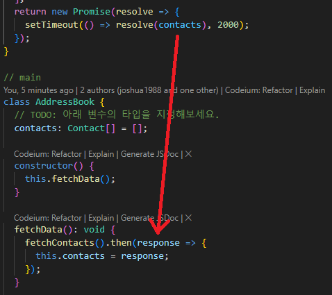

## 참고 파일

- [GitHub - joshua1988/learn-typescript: Best way to learn TypeScript](https://github.com/joshua1988/learn-typescript)
- [GitHub - gilbutITbook/080316](https://github.com/gilbutITbook/080316)

# 10장 제네릭

## 10.1 제네릭이란?

- 제네릭은 타입을 미리 정의하지 않고, 사용하는 시점에 원하는 타입을 정의해서 사용할 수 있는 문법.
- 중복 코드를 줄이고 고급 문법을 작성할 수 있게 도와줌.

## 10.2 제네릭 기본 문법


```ts
function getText<T>(text: T): T {
    return text;
}

console.log(getText<string>('hi'));
```

- 기본 문법: `function getText<T>(text: T): T { return text; }`
  - 함수 이름 오른쪽에 `<T>`를 적고, 파라미터와 반환 타입을 `T`로 정의.
  - 호출 시 타입을 지정하여 사용: `getText<string>('hi');` 또는 `getText<number>(10);`

## 10.3 왜 제네릭을 사용할까?

- 중복되는 타입 코드를 줄이기 위해 사용.
- any를 사용하는 경우 타입 안정성을 잃을 수 있지만, 제네릭을 사용하면 타입 안정성을 유지하면서 유연성을 제공.
- 코드 재사용성을 높이고, 타입 체크를 통해 오류를 줄일 수 있음.

## 10.4 인터페이스에 제네릭 사용하기

```ts
interface Dropdown<T> { 
    value: T;
    selected: boolean;
}
```

- 인터페이스에도 제네릭을 사용할 수 있음.
- 다양한 타입을 유연하게 확장 가능.

## 10.5 제네릭의 타입 제약

### 10.5.1 extends를 사용한 타입 제약

- 제네릭의 타입 제약은 제네릭으로 타입을 정의할 때 좀 더 정확한 타입을 정의할 수 있게 도와주는 문법.
- `extends` 키워드를 사용하여 제네릭의 타입을 특정 타입으로 제한할 수 있음.
  - 예시: `function embraceEverything<T extends string>(thing: T): T { return thing; }`
  - 이 함수는 `string` 타입으로만 제네릭을 사용할 수 있도록 제한함.
### 10.5.2 타입 제약의 특징

- 제네릭의 타입을 제약할 때 여러 개의 타입 중 일부만 사용할 수 있도록 제약할 수 있음.
- 예를 들어, `length` 속성을 가지는 타입으로만 제한하면 문자열, 배열, 객체 등이 해당됨.

  ```typescript
  function lengthOnly<T extends { length: number }>(value: T) {
      return value.length;
  }
  lengthOnly('hi'); // 문자열
  lengthOnly([1, 2, 3]); // 배열
  lengthOnly({ title: 'abc', length: 123 }); // 객체
  ```

- 제네릭 타입 제약의 특징:
  - 특정 타입 범위 내에서만 제네릭을 사용할 수 있음.
  - 타입 안정성을 높이고, 코드의 가독성을 향상시킴.
  - 타입 제약을 통해 의도하지 않은 타입 사용을 방지.

### 10.5.3 keyof를 사용한 타입 제약

- `keyof` 키워드를 사용하여 **특정 타입의 키 값을 추출**해 제네릭의 **타입으로 사용**할 수 있음.
  - 예시: `type DeveloperKeys = keyof { name: string; skill: string; }`
  - 이 코드는 `name`과 `skill` 문자열 리터럴 타입으로 변환됨.


- 제네릭 함수에 적용하는 예시:
  ```typescript
  function printKeys<T extends keyof { name: string; skill: string }>(value: T) {
      console.log(value);
  }
  printKeys('name'); // 정상 실행
  printKeys('skill'); // 정상 실행
  printKeys('address'); // 오류 발생
  ```

## 10.6 제네릭을 처음 사용할 때 주의해야 할 사고방식

- 제네릭을 사용할 때 혼동할 수 있는 부분은 함수 내에서 제네릭으로 받은 타입을 다루는 방법.
- **타입 제약 없이** 제네릭을 사용하면, 코드 자동 완성이나 타입이 미리 정의된 효과는 얻을 수 없음
- **제네릭 타입 제약을 통해 이러한 문제를 해결**할 수 있음.

```ts
function printTextLength<T>(text: T[]) {
    console.log(text.length);
}

printTextLength<string>(['a', 'b', 'c']); // 3
printTextLength<number>([100]); // 1
printTextLength([true, false]); // 2
```

가장 아래처럼 제네릭에 타입을 선언하지 않아도 됨. (타입 추론)
# 11 두 번째 프로젝트: 전화번호부 앱

## 11.1 프로젝트 환경 구성

- 두 번째 프로젝트는 첫 번째 프로젝트 이후 배운 내용을 복습하며 자바스크립트로 작성된 전화번호부 앱에 타입을 추가하는 것.
- 프로젝트 환경을 구성하기 위해 비주얼 스튜디오 코드를 사용.
- 프로젝트 폴더를 설정하고 필요한 라이브러리를 설치.
    - `npm i`

## 11.2 프로젝트 폴더 구조


### 11.2.1 node_modules 폴더

- 프로젝트 실행에 필요한 라이브러리가 설치되는 공간.
- `npm i` 명령어로 설치 가능.

### 11.2.2 src 폴더

- 프로젝트 실습에 필요한 소스 파일이 위치.
- 주요 파일: `index.ts`

### 11.2.3 .eslintrc.js 파일

- ESLint 설정 파일로 자바스크립트 및 타입스크립트 코드 규칙을 검사.

### 11.2.4 package.json, package-lock.json 파일

- 프로젝트 관련 정보 및 필요한 라이브러리를 지정하는 NPM 설정 파일.

### 11.2.5 tsconfig.json 파일

```json
{
  "compilerOptions": {
    "allowJs": true,
    "checkJs": true,
    "target": "es5",
    "lib": ["es2015", "dom", "dom.iterable"],
    "noImplicitAny": false
  },
  "include": ["./src/**/*"]
}

```

- 타입스크립트 관련 설정 파일.
- compilerOptions: 타입스크립트 컴파일 관련 옵션
    - allowJs: 컴파일 대상에 자바스크립트도 포함할지
    - checkJs: 자바스크립트 파일에 타입스크립트 컴파일 규칙을 적용할지
    - noImplicitAny: 타입 없으면 any로 간주할지
    - target: 컴파일된 코드가 실행될 환경 (기본값: es3)
    - lib: 기본 문법, 브라우저 API 등 자주 사용되는 문법에 대해 작성된 타입스크립트 선언 파일 사용 여부부

## 11.3 프로젝트 로직

### 11.3.1 인터페이스 코드

- `PhoneNumberDictionary` 인터페이스: 전화번호부의 각 전화번호 타입 정의.
- `Contact` 인터페이스: 이름, 주소, 전화번호 목록 정의.

### 11.3.2 API 함수

- `fetchContacts()`: 서버에 데이터를 요청하는 API 함수.
- 2초 후 전화번호부 데이터를 반환하는 프로미스를 사용.

### 11.3.3 전화번호부 클래스

- 주요 기능: 전화번호부 조회, 검색, 추가.
- 클래스 속성 `contacts`에 전화번호부 목록 저장.
- 메서드:
  - `findContactByName(name: string): Contact[]`
  - `findContactByAddress(address: string): Contact[]`
  - `findContactByPhone(phoneNumber: number, phoneType: string): Contact[]`
  - `addContact(contact: Contact): void`
  - `displayListByName(): string[]`
  - `displayListByAddress(): string[]`

## 11.4 실습

### 11.4.1 타입스크립트 설정 파일의 `noImplicitAny` 속성 값 변경

- `tsconfig.json` 파일에서 `noImplicitAny` 속성을 `true`로 변경.
- `index.ts` 파일에 타입 에러가 표시되기 시작.

### 11.4.2 타입스크립트 설정 파일의 `strict` 속성 값 변경

- `tsconfig.json` 파일에서 `strict` 속성을 `true`로 변경.
- `.eslintrc.js` 에서 `@typescript-eslint` 관련 규칙 2개 주석처리

## 11.5 프로젝트 실습 풀이: 첫 번째

- 첫 번째 실습에서는 전화번호부 앱에 타입을 추가하며 발생하는 에러를 해결.
- 각 함수의 파라미터와 반환 타입을 정의.
- ESLint 규칙에 맞춰 코드를 수정.

- Promise 참고
    - 프로미스는 비동기 처리에 사용되는 객체
    - new Promise의 첫 번째 파라미터는 resolve고, 두 번째 파라미터는 reject
    - 프로미스가 실행되었을 때 성공한 값은 resolve()에 넣고, 실패한 값은 reject()에 넣음
    - 성공한 값은 .then()의 콜백 함수에서 전달받고, 실패한 값은 .catch()의 콜백 함수에서 전달받음


## 11.6 프로젝트 실습 풀이: 두 번째

- 그냥 하면 되는데 주의사항: 결과 확인 시 fetchData 2초 걸리므로 setTimeout 후에 console 출력해야 함