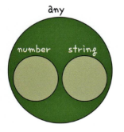

# 12장 타입 추론

## 12.1 타입 추론이란?

타입 추론이란 타입스크립트가 코드를 해석하여 적절한 타입을 정의하는 동작을 의미한다. 변수에 값을 할당하면 해당 변수의 타입이 자동으로 추론된다. 예를 들어, 다음과 같이 변수를 선언하고 숫자 10을 할당하면 타입스크립트는 이를 number 타입으로 추론한다.

```typescript
var a = 10; // number 타입으로 추론
```

## 12.2 변수의 타입 추론 과정

변수의 타입 추론은 변수에 값을 할당하지 않으면 `any` 타입으로 추론된다. 예를 들어, 다음과 같이 변수를 선언하면 타입스크립트는 `a` 변수를 `any` 타입으로 추론한다.

```typescript
var a;
```

변수에 값을 할당하면 해당 값에 맞는 타입으로 추론된다. 예를 들어, 다음과 같이 변수를 선언하고 숫자 10을 할당하면 타입스크립트는 이를 number 타입으로 추론한다.

```typescript
var a = 10; // number 타입으로 추론
```

변수 초기화 이후 값을 할당하더라도 타입이 변하지 않는다. (`any` 유지)

## 12.3 함수의 타입 추론: 반환 타입

함수의 반환 타입도 입력 값에 따라 추론된다. 예를 들어, 다음과 같은 sum 함수가 있을 때, 반환 타입은 number로 추론된다.

```typescript
function sum(a: number, b: number): number {
  return a + b;
}

var result = sum(1, 2); // number 타입으로 추론
```

## 12.4 함수의 타입 추론: 파라미터 타입

함수의 파라미터 타입도 추론된다. 예를 들어, 다음과 같은 함수가 있을 때, 파라미터 a와 b는 모두 number 타입으로 추론된다.

```typescript
function sum(a, b) {
  return a + b;
}
```

마찬가지로 반환 타입도 `number`이다.

그런데 `return a + 'hi'` 였다면 반환 타입은 `string` 이 된다. javascript 에서 문자열 + 숫자는 문자열이라 그렇다.

## 12.5 인터페이스와 제네릭의 추론 방식

- 인터페이스와 제네릭 타입도 주어진 타입 정보로 관련 타입이 정확하게 추론됨

  ```typescript
  interface Dropdown<T> {
    value: T;
    title: string;
  }
  let items: Dropdown<number> = { value: 10, title: '숫자' };
  ```

## 12.6 복잡한 구조에서 타입 추론 방식

- 복잡한 구조에서도 타입이 정확하게 추론됨

  ```typescript
  interface Dropdown<T> { value: T; title: string; }
  interface DetailedDropdown<K> extends Dropdown<K> { description: string; tag: K; }
  let shoppingItem: DetailedDropdown<string> = { value: 'value', title: 'title', description: 'description', tag: 'tag' };
  ```

# 13장 타입 단언

## 13.1 타입 단언이란?

타입 단언(Type Assertion)은 타입스크립트의 타입 추론에 기대지 않고 개발자가 직접 타입을 명시하여 해당 타입으로 강제하는 것을 의미함. 

이미 운영되고 있는 자바스크립트 애플리케이션에 타입스크립트를 점진적으로 적용할 때나 타입스크립트에 아직 익숙하지 않아 타입을 정확히 정의할 줄 모를 때 주로 사용함. 

```typescript
var myName = '세호';  // 타입 추론에 의해 string 타입이 됨
var myName: string = '세호';  // 명시적 타입 선언
var myName = '세호' as string;  // 타입 단언 사용
```

선언하는 시점에 속성을 모두 정의하지 않고 추후에 추가할 수 있어서 유연하게 활용 가능.

```ts
interface Person {
    name: string;
    age: number;
}

var joo = {}; // 빈 객체로 초기화 해서 아래처럼 속성 추가 불가
joo.name = '형주';  // X
joo.age = 31; // X

var joo: Person = { // 타입은 선언했지만 속성을 안 채워서 타입 검사 에러
}

var joo = {} as Person; // Person으로 단언했으므로 타입 검사 스킵하고 일단 생성
joo.name = '형주';
joo.age = 31;
```

## 13.2 타입 단언 문법

### 13.2.1 타입 단언의 대상

타입 단언은 숫자, 문자열, 객체 등 원시 값뿐만 아니라 변수나 함수의 호출 결과에도 사용할 수 있음.

```typescript
function getId(id) {
  return id;
}

var myId = getId('josh') as number;
```

### 13.2.2 타입 단언 중첩

타입 단언은 여러 번 중첩하여 사용할 수 있음.

```typescript
var num = (10 as any) as number;
```

### 13.2.3 타입 단언을 사용할 때 주의할 점

타입 단언은 타입 안전성을 해칠 수 있으므로 필요한 경우에만 사용해야 함. 호환되지 않는 타입 간의 단언은 런타임 에러를 유발할 수 있음.

```typescript
var num: number = 10;
var str: string = num as unknown as string;  // 위험한 코드
```

#### 13.2.3.1 `as` 키워드는 구문 오른쪽에서만 사용

타입 단언은 변수 이름에 사용할 수 없음. 다음과 같이 작성하면 타입스크립트 컴파일러가 인식하지 못함.

```typescript
var num as number = 10;  // 에러 발생
```

타입 단언은 다음과 같이 구문 오른쪽에서 사용할 수 있음.

```typescript
var num = 10 as number;
```

#### 13.2.3.2 호환되지 않는 데이터 타입으로는 단언할 수 없음

타입 단언을 이용하면 어떤 값이든 원하는 타입으로 단언할 수 있을 것 같지만, 실제로는 그렇지 않음. 다음과 같이 작성하면 타입 에러가 발생함.

```typescript
var num = 10 as string;  // 에러 발생
```

에러 메시지를 보면 `number` 형식을 `string` 형식으로 변환할 수 없다는 내용이 나옴. 두 형식이 충분히 겹치지 않기 때문임.



```typescript
var bookName: string = '타입스크립트';
var bookName: any = '타입스크립트';
```

이 코드에서 `bookName` 변수는 문자열이 할당되었기 때문에 `string` 타입으로도 선언할 수 있고, `any` 타입으로도 선언할 수 있음.

타입끼리 대체가 가능하면 타입이 겹치는 부분이 있다고 보면 됨. 하지만 다음 코드처럼 값이 숫자인 경우 강제로 문자열 타입으로 단언할 수 없음.

```typescript
var num = 10 as any;
```

타입은 값에 대한 부가 정보이며, `as`로 변경한다고 해서 값 자체가 바뀌지는 않음.

#### 13.2.3.3 타입 단언 남용하지 않기

- 타입 단언 시 컴파일 타임에 아무 것도 안 하기 때문에 런타임에 타입 에러가 발생할 수 있음

## 13.3 null 아님 보장 연산자: !

null 아님 보장 연산자(non-null assertion operator)는 null 타입을 체크할 때 유용하게 쓰는 연산자임. 이는 타입 단언의 한 종류로, `as` 키워드와는 용도가 다름. 값이 null이 아님을 보장해 줌. 이 연산자를 알아보기 전에, null 처리가 왜 중요한지 자바스크립트 코드로 살펴보겠음.

```javascript
function shuffleBooks(books) {
  var result = books.shuffle();
  return result;
}
```

이 코드는 책 목록을 받아 순서를 랜덤으로 섞는 함수임. 이 함수를 실행하면 함수의 파라미터 `books`에 `shuffle`이라는 메서드가 제공되어 책 목록이 랜덤하게 뒤바뀐다고 가정하겠음. 이 함수를 다음과 같이 호출하면 어떻게 될까?

```javascript
shuffleBooks();
```

인자를 넣지 않고 호출하면 함수의 `books.shuffle()` 코드에서 다음과 같은 에러가 발생함.

```text
Uncaught TypeError: Cannot read properties of undefined (reading 'shuffle')
```

이런 에러가 발생하는 이유는 `books`가 undefined이기 때문임. 따라서 예전부터 다음과 같은 null 체크 코드를 작성해 왔음.

```javascript
function shuffleBooks(books) {
  if (books === null || books === undefined) {
    return;
  }
  var result = books.shuffle();
  return result;
}
```

이번에는 타입스크립트 코드로 예제를 살펴보겠음.

```typescript
interface Books {
  shuffle: Function;
}

function shuffleBooks(books: Books | null) {
  var result = books!.shuffle();
  return result;
}
```

이 코드는 함수의 `books` 파라미터가 `Books` 인터페이스 또는 null일 수 있음을 나타냄. `books`가 null이 아니라고 보장하기 위해 `!` 연산자를 사용함. 이 연산자를 사용하면 타입스크립트는 `books`가 null이 아니라고 간주하여 `shuffle` 메서드에 접근할 수 있게 됨. 

그러나 `!` 연산자는 **실제로 null 값이 들어오면 실행 시점에 에러를 발생**시킬 수 있으므로 주의해야 함. 다음은 null 아님 보장 연산자를 사용한 예제 코드임.

```typescript
function sayHi(message: string | null) {
  if (message!.length >= 3) {
    console.log(message);
  }
}
```

이 코드에서 `message`가 null이 아니라는 의미로 `!` 연산자를 붙였기 때문에 `message`는 string 타입으로 간주됨. 이렇게 하면 `message.length`에 접근할 수 있음.

> null이 절대 들어오지 않는다는 확신이 있을 때만 사용! 아니면 런타임 에러 발생함.